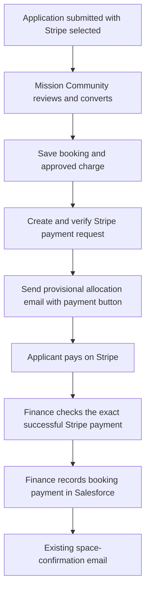

# NTE Stripe implementation plan

Prepared 8 September 2026 for the project owner and Mission Community. **Internal planning document.**

The requested journey is feasible: an exhibitor or partner/sponsor chooses Stripe on the application; Mission Community converts the application; Salesforce creates a payment request for that exact booking; the existing provisional-allocation email includes its itemised amount and payment button alongside the existing preparation details.

**Current selection: Stripe Payment Links with manual payment confirmation.** After researching the alternatives, the owner selected manual confirmation and subsequently Payment Links only, explicitly excluding Stripe Invoicing. Optional post-payment invoice creation must stay disabled. The client still needs to grant Stripe access and confirm financial configuration. The [manual setup and test plan](NTE_STRIPE_MANUAL_SETUP_AND_TEST_PLAN_2026-09-08.md) is the current execution-planning companion; automatic/assisted confirmation and other payment products below are retained as historical comparisons. Proposal **11** remains the stable implementation reference. Remaining tax, invoice-process and operational policies need decisions, and no Stripe integration has been implemented or deployed by this planning work.

## 1. What is established, and what still needs proving

| Evidence | Finding | Limit |
| --- | --- | --- |
| Current application source and conversion Flow | Both application types offer Stripe. `Lead.Payment_Method__c` maps to `Opportunity.NTE_Payment_Method__c`. | Choosing Stripe currently records a preference; it does not create a payment request. |
| Current approval service | Explicit converted Lead/Opportunity IDs, background dispatch, primary-Contact routing, price checks, failed-send recovery and duplicate protection already exist. `coordinatedPaymentReadinessError` is the intended extension point and currently returns no Stripe requirement. | The present worker does not implement a Stripe callout or settlement verification. |
| Current finance/confirmation source | Recording booking payment calls the existing one-per-booking confirmation dispatcher. Top-up finance is separate. | Updating a checkbox through an API alone would bypass the controller's confirmation call. |
| [Read-only live Salesforce query, 8 September](audit/NTE_STRIPE_FEASIBILITY_2026-09-08.json) | `mission-mmuat` is **Enterprise Edition**, `IsSandbox=true`, instance `GBR2S`. A normal authenticated REST-backed query succeeded. Source targets API 67; the CLI query used API 68. | This verifies edition and existing API access, not a future integration user's permissions, credentials, quota headroom or a Stripe connection. Production has not been independently inspected. |
| Completed September release | Existing qualified baseline is 423 components/281 tests; the audit preserves its finite coverage. | Those tests are not Stripe integration tests. No Stripe request, charge, webhook, customer email or deployment occurred during this planning task. |

Salesforce documents outbound Apex HTTP calls, secure Named/External Credentials and authenticated Apex REST services. Its API overview includes Enterprise Edition. These are supported building blocks for both routes; the design does not require Salesforce Payments, Revenue Cloud, a participant portal or an AppExchange payment package. An integration user's licence/object entitlement and available API capacity must still be checked in the target org. [Apex callouts](https://trailhead.salesforce.com/content/learn/modules/apex_integration_services/apex_integration_callouts), [API availability](https://trailhead.salesforce.com/content/learn/modules/api_basics/api_basics_overview), [Named Credentials](https://developer.salesforce.com/docs/platform/named-credentials/guide/get-started.html).

Local source evidence: [conversion Flow](force-app/main/default/flows/NTE_Copy_Converted_Lead_to_Opportunity.flow-meta.xml), [provisional email coordinator](force-app/main/default/classes/NTEExhibitorApprovalEmailService.cls), [finance actions](force-app/main/default/classes/NTE_MasterPanelController.cls), [booking confirmation dispatcher](force-app/main/default/classes/NTEEmailDispatchService.cls), [Primary Contact resolver](force-app/main/default/classes/NTEBookingContactService.cls), [pricing service](force-app/main/default/classes/NTEPricingService.cls). Existing requirements and release evidence remain in [desired workflow](NTE_DESIRED_WORKFLOW.md), [proposals](NTE_CHANGE_PROPOSALS.md), [audit checkpoint](NTE_AUDIT_RESUME.md) and [numbered audit](audit/NTE_STRESS_TEST_AND_IMPROVEMENTS_2026-09-07.md).

## 2. Shared applicant journey

1. The applicant submits the appropriate application with payment method Stripe. The application acknowledgement remains under review. It contains no payment or preparation link.
2. Mission Community reviews the application in NTE Management/Master Panel and chooses Convert. Rejection creates no charge.
3. Conversion commits a distinct event booking with its exact source application and Primary Contact. The normal new-booking pricing calculation supplies validated, itemised saved prices.
4. The integration checks merchant, payment method, event, charge identity, tax/billing readiness, positive payable total and recipient. A genuinely complimentary booking uses its existing immediate-confirmation route.
5. A background process creates or recovers the booking's fixed Stripe request, verifies the response and saves its identity, amount, currency, link and financial revision.
6. The existing NTE provisional email is rendered from that same saved financial revision. It retains package/space details, agreement text, staff instructions, logo link and applicable vehicle link, with a clear payment button and net/tax/total where applicable.
7. Salesforce's accepted email send records the corresponding invoice/link-provided milestone. Creation of a Stripe object alone does not mark a link as sent. Accepted sending does not prove inbox delivery.
8. The applicant follows the button to Stripe's hosted page and pays. Card entry and any bank authentication occur on Stripe.
9. Under the selected manual route, finance verifies the exact successful Stripe payment and records it in Salesforce; that staff action queues the existing space-confirmation email. Successful Stripe payment alone does not record the Salesforce milestone. Preparing staff, vehicle and logo details remains possible before payment.
10. Paid/confirmed space remains distinct from Completed. Outstanding preparation or an unpaid staff top-up can still prevent Completed; payment does not send the final pack or automatically change Opportunity StageName to Closed Won.

The master panel's finance actions and application lifecycle remain the staff workspace. Proposed operational status should be concise, for example Preparing payment link, Awaiting payment, Payment awaiting review or Payment needs attention. Preserve the four agreed finance refiners; any extra status must serve an actual action, without restoring the removed Email activity panel.

## 3. Route A — Mission Community confirms payment manually

**Selected route.** Plan A1 Dashboard verification as the baseline. A2 is an optional future enhancement; choosing manual confirmation does not require an incoming integration.

**Mechanism.** Automatic link creation and provisional email sending are exactly as above. Stripe records the payment. The configured finance users receive Stripe notifications and review the saved Stripe payment/request, booking reference, full amount and currency. An authorised user selects Booking payment received in Salesforce. The existing confirmation email is queued once, with that person's audit identity.

Stripe supports manual fulfilment from its Dashboard, notification emails and reports. Its successful-payment notifications are configured per team member; creating an account or link does not establish who will receive them. [Manual and automatic fulfilment](https://docs.stripe.com/checkout/fulfillment?payment-ui=stripe-hosted), [team notification settings](https://docs.stripe.com/get-started/account/teams).

| Manual variant | Additional setup | What Salesforce knows before the human confirms |
| --- | --- | --- |
| A1: Dashboard verification | Outbound Stripe credential; agreed finance users and notifications; save Stripe IDs/reference with the manual action. No public webhook receiver is required. | Link sent and payment not yet recorded. Staff must check Stripe; the panel must not imply it is live-synchronised. |
| A2: Assisted manual review | Add the same webhook/reconciliation pipeline described for Route B, but keep its final approval policy Manual review. Alternatively scope an on-demand Check Stripe action. | Verified processor payment evidence and a review action. Booking remains provisional until the authorised person confirms it. |

**Controls.** A payment notification is a prompt to inspect the actual transaction. Verify the gross charge, currency, successful state and exact request; preserve payment ID, actual payment time, reviewer and review time separately. Repeated review or later webhook delivery cannot generate another booking confirmation. Bank-transfer confirmation remains available under its existing policy. If staff record another payment method for a booking with an open Stripe request, close/reconcile that request so the applicant cannot accidentally pay again.

**Tradeoff.** A1 has the fewest technical dependencies but needs a named daily finance owner and cover during absence. Applicants may have a Stripe receipt while the NTE space-confirmation email waits for staff. A2 preserves the human decision while reducing matching work; its infrastructure effort is close to Route B.

**Salesforce feasibility.** The manual milestone and confirmation dispatch already exist in this package. Add evidence/reference storage and use the established service. No incoming external API is needed for A1. Meaningful qualification still needs actual Stripe test-mode payments and the real merged NTE emails before release.

## 4. Route B — researched automatic alternative, not selected

**Mechanism.** Stripe sends a signed event to a secure HTTPS receiver. The receiver durably records it and a worker retrieves the actual Stripe resource. The integration matches the saved request and validates the payment. Salesforce records payment and queues the existing space-confirmation email through a shared payment service. Finance receives the agreed success or exception notification.

The recommended transport is a small service in a **client-owned managed hosting account**, using Stripe's maintained SDK for signature verification and a durable queue. It authenticates to a narrowly scoped Salesforce Apex REST endpoint through an External Client App and a dedicated integration user. The client chooses the hosting provider and operational owner; none is assumed to exist already. The existing static forms and GitHub Pages preview are not webhook hosts.

Salesforce supports Apex REST with OAuth. For a new inbound integration, plan an **External Client App**, rather than assuming a new legacy Connected App can be created: Salesforce restricted new Connected App creation from Spring '26. Client credentials is a documented server-to-server option with an assigned integration user. The Salesforce client secret and Stripe API/webhook secrets have different purposes. [Apex REST](https://trailhead.salesforce.com/content/learn/modules/apex_integration_services/apex_integration_webservices), [External Client App policy](https://help.salesforce.com/s/articleView?id=005228017&language=en_US&type=1), [client credentials flow](https://help.salesforce.com/s/articleView?id=xcloud.remoteaccess_oauth_client_credentials_flow.htm&language=en_US).

A direct public Salesforce Site/Apex receiver is an alternative requiring separate proof of guest access, raw-body signature handling, secure signing-secret storage, limits and queue persistence. It is not the default dependency. Stripe does not acquire a Salesforce OAuth token simply because a private Apex REST URL is supplied. A periodic authenticated Salesforce-to-Stripe reconciliation worker can recover missing notifications; polling alone has scheduled latency and requires a separate capacity/coverage design if chosen as the primary transport.

### Verification and application

Treat the event as a signal to examine the payment, not permission to set arbitrary Opportunity fields. The receiving API should accept a constrained event/resource identity. A trusted verifier must obtain the authoritative Stripe state under the expected merchant account; Salesforce then resolves that resource through its own saved mapping. Restrict the endpoint to the integration principal and explicitly enforce permitted objects, fields and actions. `with sharing` alone does not provide field/object permission enforcement.

Before automatic confirmation, require all of the following:

- Valid signature, correct environment and expected account; payment object belongs to the saved request.
- Exact booking, event and charge type; the resource is the active authorised financial revision.
- Correct currency and full payable amount. For Payment Links with local-currency presentment, use the integration amount/currency for comparison and retain presentment details separately.
- A successful captured payment, not a link click, an authorisation, a checkout-page completion or an expected payout. Inspect current state to catch an already refunded or disputed charge.
- A still-eligible booking and no unresolved cancellation, replacement, conflicting manual payment, partial payment or other exception.
- A durable record that this actual payment has not already been applied to this or another charge.

For Payment Links/Checkout, use `checkout.session.completed` and inspect payment status; delayed methods additionally need `checkout.session.async_payment_succeeded` and `checkout.session.async_payment_failed`. A completed checkout is not always a successful payment. The return page is informational and cannot be the source of payment truth. [Stripe fulfilment requirements](https://docs.stripe.com/checkout/fulfillment?payment-ui=stripe-hosted).

For Invoicing, invoice events identify the request, but **invoice.paid is not by itself proof that Stripe collected the money**. Stripe permits an invoice to be marked paid outside Stripe without a charge. Inspect its associated payment evidence and residual balance; credits, zero balances, forgiven amounts and out-of-band payments need explicit accounting treatment. Qualify the selected stable API's invoice-payment relationships rather than assuming an older `invoice.payment_intent` field exists. [Invoice payment API](https://docs.stripe.com/api/invoices/pay).

### Reliability and operational recovery

The receiver must validate the signature using the unchanged request body, durably save accepted work, and respond quickly. If durable acceptance fails, return failure so delivery can be retried. After accepting, the service owns retrying work through Salesforce outages. Deduplicate deliveries by merchant/environment/event ID and also protect the payment/charge business operation. Record processing state; an existing Received event is not equivalent to an Applied event.

Stripe documents duplicate events, no delivery-order guarantee and live retries for up to three days. Plan persistent retries with backoff, bounded attempts, an actionable failed-work queue and reconciliation beyond that window. Pin and test the event and request API versions. [Webhook delivery and verification](https://docs.stripe.com/webhooks).

Reconciliation should compare Stripe with saved unsettled requests and recent payment adjustments using paginated, overlapping windows and durable cursors. Also enumerate relevant Stripe objects by the integration's account/environment and metadata to find requests created before a Salesforce save failed. Dashboard alerts must reveal stale queues and unprocessed events; no quiet loss after a 2xx response. Proposed starting targets: process ordinary events within a few minutes, flag sustained delays and run a daily finance reconciliation. These are service targets to qualify, not timing guarantees or automations created by this task.

Payment evidence and the payment milestone must remain saved if confirmation-email rendering or delivery fails. Use a durable confirmation intent and recover it separately. Reuse the existing unique booking-confirmation key. Never make webhook processing depend on a user's browser returning to the site or an email reaching an inbox.

**Tradeoff.** Faster applicant confirmation and less finance work, at the cost of a receiver, queue, integration authentication, monitoring, reconciliation and a runbook. An outage delays Salesforce confirmation but must not lose a successful Stripe payment or instruct the applicant to pay again.

## 5. Preserving a future change of confirmation route

Use one shared payment-request model, Stripe adapter, email coordinator and payment-recording service. Store **processor evidence** separately from **Mission Community's confirmation decision**.

| Shared component | Route A | Route B |
| --- | --- | --- |
| Conversion, approved charge snapshot, request creation and email | Same | Same |
| Processor evidence | Staff verification in A1; integration verification in A2 | Integration verification |
| Decision to confirm | Authorised staff action | Policy permits verified full payment |
| Booking payment audit | Human reviewer plus Stripe evidence | Integration identity plus Stripe evidence |
| Confirmation email | Existing unique dispatcher | Same dispatcher |
| Failures and manual recovery | Reviewed action | Reviewed exception action |

Define the confirmation policy per event/configuration, then snapshot its version on each issued request. A later setting change must not retrospectively confirm old bookings or send historical emails. Moving A1 to A2/B adds the return path, without replacing valid issued payment links. Moving B to manual stops automatic business confirmation while preserving incoming payment evidence, history and recovery. Any pending payments at the changeover need an explicit reviewed migration rule.

This plan does not require implementing every variant. Build the shared contracts once and qualify the selected A1 manual route. A2/B remain future options that need their own scope and qualification if requested.

## 6. Choosing the Stripe payment page is a separate decision

The email can contain a normal **Pay £X** button with any of these approaches. The product decision should follow who issues the financial document and how long the link must remain usable.

| Product | Fit for NTE | Conditions and limitations |
| --- | --- | --- |
| Dedicated Stripe Payment Link for each booking charge | A straightforward payment collector when the client retains its invoice/accounting process. Create fixed line items through the API. | Set `restrictions[completed_sessions][limit]=1`; disable adjustable quantities, promotion codes and optional extras. A generic shared package link is unsuitable for exact booking matching. Inspect concurrent sessions and replacement/cancellation behaviour. |
| Stripe Invoice with its hosted payment page | Strong option if the client wants Stripe to issue the formal invoice, PDF and payment status against one receivable. | Agree seller identity, tax and invoice-number ownership. Additional Invoicing fees apply. Control automatic invoice emails, reminders, existing customer balances/discounts and collection behaviour. |
| Stripe Checkout behind a stable NTE payment URL | Useful if the client needs tighter control of the payment page, expiry and GBP-only presentation while keeping invoice generation elsewhere. | Requires an additional secure link-resolution service. An emailed raw Checkout Session normally expires after 24 hours, with a supported custom window of 30 minutes–24 hours. Create/reuse an eligible session when the stable link is used. |

Payment Links can use inline fixed price data and automatically deactivate after the configured completed-session limit. The limit refers to completed checkout sessions, so delayed-method failures still require a recovery policy. Never claim the application can rely on a link being reusable until cash settles. [Payment Links API](https://docs.stripe.com/payment-links/create), [one-use restriction](https://docs.stripe.com/payment-links/customize), [Checkout expiry](https://docs.stripe.com/payments/checkout/how-checkout-works).

**Currency nuance discovered during this review:** Stripe currently documents Adaptive Pricing as always enabled for Payment Links. Overseas applicants can therefore be offered a local-currency amount. The integration amount remains the configured currency, with separate presentment details. If the client requires the page to display/charge only GBP, qualify a configured hosted Invoice or Checkout approach instead of promising a Payment Link switch that Stripe does not document. [Adaptive Pricing](https://docs.stripe.com/payments/currencies/localize-prices/adaptive-pricing?payment-ui=stripe-hosted).

A hosted Invoice provides the bill, payment and PDF at a private URL. Its URL also has an expiry policy: normally 30 days after the due date, with a maximum 120-day window. Provide a verified refresh/resend path and do not promise a permanent invoice URL. [Hosted Invoice Page](https://docs.stripe.com/invoicing/hosted-invoice-page).

**Recommendation to take to the client:** use dedicated Payment Links if its established finance system remains the sole invoice issuer and local-currency presentation is acceptable. Prefer Stripe Invoicing if it wants Stripe to own the invoice for these bookings. Choose stable-link Checkout only for a concrete requirement the first two cannot satisfy. Both manual and automatic confirmation are compatible with all three.

For Invoicing, create a draft with `collection_method=send_invoice`, set `auto_advance=false`, explicitly attach only this request's invoice items and finalise deliberately. Save and verify the returned URL before the NTE email. Do not invoke Stripe's invoice-send endpoint for the same initial message. These settings avoid automatic charging of a saved card and unplanned invoice/reminder emails; separately configure intended receipts. Qualify customer-level discounts, credits and default payment methods so an existing customer's settings cannot silently alter the bill. [Invoice creation](https://docs.stripe.com/api/invoices/create), [automatic advancement controls](https://docs.stripe.com/invoicing/integration/automatic-advancement-collection).

Payment Links can optionally generate a paid invoice after payment, but that does not satisfy a requirement for a numbered invoice before payment and can introduce another email/document. Enable it only if selected as part of the finance design. [After-payment documents](https://docs.stripe.com/payment-links/post-payment).

## 7. Amount, VAT and finance rules

**Current booking and top-up totals are excluding VAT.** Never copy the current net total directly into a Stripe gross charge without the agreed treatment. Finance must confirm the legal seller, VAT registration, treatment of each package/space/power/staff item, any applicable exceptions, tax point and rounding policy. A discounted charity category is not itself evidence that a charge is VAT-exempt.

For illustration only, if finance confirms 20% VAT on all three lines:

| Charge | Net | VAT | Gross |
| --- | ---: | ---: | ---: |
| Exhibition space | £800.00 | £160.00 | £960.00 |
| Power | £100.00 | £20.00 | £120.00 |
| Original additional staff | £50.00 | £10.00 | £60.00 |
| Total | £950.00 | £190.00 | **£1,140.00** |

The Stripe charge would be **114000 pence**. This example does not set NTE's tax policy.

Save exact decimal line prices, quantities, net, tax, gross, currency, pricing version, tax policy and rounding result. Round once under the agreed line/invoice method, then convert the final GBP amount to integer pence. Use those saved facts for the financial email, payment request and reconciliation. Keep the existing net-value reporting semantics; add gross collected, VAT, processor fees and payout amounts separately instead of silently turning Opportunity Amount into a gross or net-of-fees field.

Use either approved fixed tax rates or a qualified tax calculation whose result is fixed before the email. If Stripe Tax calculates a different amount from an address entered later, the email cannot truthfully promise an identical fixed gross total without further design. Decide that before implementation. Do not add tips, editable quantities, promotion codes, dynamic shipping charges or a processing-fee surcharge to this booking flow.

An itemised email or receipt is not automatically the client's formal invoice. Finance must own the document designation, unique numbering, seller/buyer details and tax content. Government guidance lists required invoice information and distinguishes VAT invoices. [Invoice requirements](https://www.gov.uk/invoicing-and-taking-payment-from-customers/invoices-what-they-must-include).

**Quote/PO/agreement dependency:** both forms ask about quotes before invoicing, PO references and supplier agreements. The agreed combined email can fulfil a requested quote only when finance accepts that document. A sent quote does not prove a PO arrived. Decide whether Convert means all finance prerequisites are cleared, or whether specific bookings remain held before payment-request creation. Do not silently introduce a universal PO hold or bypass a required one.

Both current forms word their choice as invoice versus Stripe, although invoice need and payment method are separate concepts. Billing details are already collected for chargeable applications. A proposed copy refinement is a direct Payment method choice (Stripe / Bank transfer), keeping quote and billing questions separately; it needs inclusion in the approved Stripe form scope, not an unrelated wording rewrite during planning.

## 8. Salesforce implementation outline

### Durable records and identifiers

Use the Opportunity as the booking and preserve the existing finance flags. Add technical payment-request records rather than trying to encode all financial state in one editable URL field. Proposed schema names below are design suggestions, not deployed metadata.

| Record | Suggested information |
| --- | --- |
| `NTE_Payment_Request__c` | Exact booking/source Lead/event, charge kind Booking or Staff top-up, revision, immutable financial snapshot, unique operation key, confirmation-policy version, request state, Stripe account/environment/product/IDs, verified URL, expiry if relevant, sent milestone, error/attempt times and accepted payment reference. |
| `NTE_Stripe_Operation__c` or equivalent durable journal | Each create/finalise/deactivate/retrieve operation; stable idempotency key, payload hash, known Stripe result, retry count, next attempt and ambiguous-outcome status. Keep secrets and sensitive payloads out of general logs. |
| `NTE_Stripe_Event__c` when the return path is enabled | Unique account/environment/event ID, resource/payment ID, received/verified/applied timestamps, processing result and retry state. Separate actual paid time from Salesforce recorded time. |
| Existing email records/status | Continue provisional status/audits and `NTE_Email_Dispatch__c` for booking confirmation. Link to the relevant financial revision without creating a parallel confirmation sender. |

Allow one active request revision for each charge. Technical retries or corrected requests do not authorise additional staff purchases: there remain only the original booking and the single already-permitted top-up. Replacement history is retained. Do not match a payment by email, company name, last-modified record, a browser-supplied reference or amount alone. Stripe metadata supports correlation; the authoritative mapping is the saved account/environment/request identity. Minimise Stripe metadata to opaque request ID, event and charge identifiers; omit attendee, accessibility and logistics data.

### Separate transaction responsibilities

1. **Conversion transaction:** save the exact booking, validated charge snapshot and durable request, then enqueue post-commit work. No Stripe network call or premature Stripe email here.
2. **Claim transaction:** select eligible requests and persist a worker lease/operation identity. Commit before making network calls.
3. **Callout transaction:** perform the idempotent Stripe operation and retrieval before any DML in that transaction. After the callout, reacquire the relevant records and check the lease, financial revision, cancellation and payment state; then persist the result. A stale result is retained for reconciliation and deactivation, not sent.
4. **Dispatch transaction:** with no network calls, lock/recheck the request, booking and exact Primary Contact, then render/send the combined email and save accepted-send facts. A failed message reuses the saved request.
5. **Evidence transaction:** for the selected confirmation route, record verified processor evidence. Apply the authorised business milestone through the shared service, then make the unique confirmation intent durable. Recover failed notification separately.

Salesforce disallows a callout while uncommitted database work is pending. The existing approval worker performs DML and holds recipient/booking locks; inserting Stripe calls into its email loop would be the wrong transaction structure. Network calls and Salesforce changes are not one atomic transaction. Preserve durable intent and reconcile external success after local failure. [Salesforce callout transaction constraint](https://help.salesforce.com/s/articleView?id=000079772&language=en_US&type=1).

Batch by measured callout cost, asynchronous-job, CPU/heap and email limits. Do not launch one job per record from a bulk conversion without budgeting the transaction. Revalidate after network calls; do not rely on a lock remaining an adequate reservation across an external request. Test genuine overlapping work in the sandbox.

### Retry and replacement rules

Every Stripe mutation has its own stable saved operation key. Timeout after creation must reuse/retrieve the original request. Stripe retains idempotent results, including failures, and keys can be removed after at least 24 hours; its cache is not a permanent duplicate-prevention database. An old ambiguous request needs exact resource/operation reconciliation before a new key is allowed. A search returning no result immediately is not proof the original request was never created. [Stripe idempotency](https://docs.stripe.com/api/idempotent_requests).

When price, currency, tax or payment method changes, hold the existing request. Resolve open/paid/in-flight state, close the earlier collection route where possible, and issue a versioned replacement only through an authorised correction. Concurrent already-open checkout sessions must be included in testing. A second actual payment is an overpayment exception; deduplicating its webhook must not hide the extra money. Refunds require human financial authority.

### Change locations

- `NTE_Copy_Converted_Lead_to_Opportunity`: route Stripe bookings into durable request preparation using the exact conversion IDs; retain both participant types and complimentary/bank paths.
- `NTEExhibitorApprovalEmailService`: implement Stripe readiness and request-aware payment note/financial summary/button; preserve recipient and native HTML/plain-text merge checks.
- `NTE_MasterPanelController`: extract reusable payment-recording business logic from the manual UI method; retain user-mode permissions for human actions and explicit integration permissions for automatic actions.
- `NTEEmailDispatchService`: reuse the existing `BOOKING_CONFIRMED` dispatch identity and failed-only recovery.
- Pricing helpers, fields, report formulas, permission sets, Lightning views, generator, communications builder and manifest: add the chosen facts/status without changing historical net totals or restoring retired pricing.
- Add the selected Stripe service/queue/reconciliation classes and, for B/A2, the authenticated inbound endpoint and hosted receiver. Keep endpoint versions explicit.
- Revise the two provisional sources and their generated Salesforce/native examples, plus chosen form payment wording. Published preview examples must use safe non-payable examples, never a real applicant's payment URL.

## 9. Existing workflow decisions that affect safe payment collection

**P03: distinct booking on conversion.** The completed audit demonstrated that native conversion can create no Opportunity, or reuse an existing paid Opportunity and replace application fields while old payment flags survive. This is especially dangerous once a Stripe request is attached. Recommend requiring a new booking per approved application, allowing existing Account/Contact reuse. A controlled NTE conversion service can enforce it across the authorised route; other native/API conversion paths need a qualified guard that rolls back the whole invalid conversion. A timestamp or 'inserted this transaction' shortcut is insufficient. This remains a client/owner decision and implementation prerequisite, not an approved fix. [P03 evidence](audit/NTE_STRESS_TEST_AND_IMPROVEMENTS_2026-09-07.md#p03--decide-the-permitted-native-conversion-options).

**P01: provisional retry after payment.** Existing policy permits payment confirmation even if the earlier provisional email failed. With Stripe, a later retry must not demand payment again or describe a confirmed space as provisional. Recommend preserving the failed audit and using a paid preparation-information recovery message or an explicit superseded status. This changes an undecided edge and needs selection; do not suppress payment evidence while waiting for an email retry.

**Cancelled bookings.** Continue accepting preparation updates, as already agreed. Payment collection is a different action: recommend disabling new/unpaid collection requests when a booking is cancelled and routing in-flight/late payments to finance. Never automatically reinstate a booking or refund money merely because a delayed event arrives.

**Staff top-up order.** The accepted top-up is independent of booking payment and may occur before it or after a final pack. Its own request must never modify the original paid booking amount or send a second space-confirmation email. The existing controller deliberately prevents recording top-up payment before booking payment. If both Stripe links can be paid concurrently, payment evidence may arrive in the reverse order. Decide between delaying the top-up payment link until booking payment, or saving top-up payment evidence immediately while applying the finance milestone in the approved order. Do not discard real money or quietly change the booking-first rule. Do not auto-charge a saved card for a top-up.

The first release can be limited to booking charges with top-up handling remaining manual, provided that boundary is chosen and made clear. Proposal 11 previously included the single top-up; do not silently remove it from the scope.

## 10. Notifications and recipients to configure

| Event | Proposed sender and recipient | Rule |
| --- | --- | --- |
| Application received | Existing Salesforce applicant/internal messages | Existing Lead routing remains. |
| Conversion and payment request ready | NTE email to the exact Opportunity Primary Contact | Preserve existing booking/preparation sections. No silent billing-contact substitution or CC. |
| Successful payment receipt | Stripe, if enabled, to the selected/collected payer receipt address | Client chooses receipt behaviour; this may be a different person from the booking Primary Contact. Test the actual product/settings. |
| Booking space confirmed | Existing Salesforce confirmation to Primary Contact | Route A after human confirmation; Route B after verified automatic confirmation; once per booking. |
| Payment received for finance | Agreed Stripe team notifications in A1; optional structured integration notice in A2/B | Name actual recipients and choose success-notice volume. Avoid duplicating equivalent notices from both systems. |
| Processing failure, mismatch, late payment, refund/dispute, payout issue | Named finance/integration owner | Actionable reference, amount and recovery link; no card data or general recipient blast. |

Stripe receipts and NTE space confirmation serve different purposes. Neither substitutes for agreeing the formal invoice. Native receipt behaviour is configurable; do not assume Stripe will send every desired message automatically. [Receipts](https://docs.stripe.com/receipts), [team preferences](https://docs.stripe.com/get-started/account/teams).

Retain sent-recipient history if the booking contact changes. On recovery, resolve the current authorised Primary Contact and apply the existing changed-recipient checks. A payment made by a colleague still applies to the original booking through request identity; it must not overwrite Salesforce Contact or billing details.

## 11. Setup inventory

| Needed | Owner/input | Acceptance evidence |
| --- | --- | --- |
| Correct Stripe merchant | Client finance/admin: legal seller, country, account ID, live eligibility and authorised account access | Verify authenticated account identity, charge capability and branding; independently confirm the intended payout bank in Stripe. No account or bank number is supplied per application. |
| Commercial policy | Client finance: GBP base pricing, VAT treatment/registration, tax rounding, full payment versus deposit, invoice issuer, numbering, PO/agreement handling | Signed sample bill and charge, with an agreed payment due/expiry policy. Full booking payment is the planning assumption; deposits/instalments are not assumed. |
| Confirmation policy | Manual confirmation selected; plan A1 Dashboard verification | Successful Stripe payment alone leaves Salesforce provisional; the correct staff action sends one confirmation. Resolve top-up order and exception evidence. |
| Stripe configuration | Authorised admin: test environment, restricted integration key, permitted methods, receipt settings, branding, descriptor, support contacts and invoice/tax settings where selected | Test/live credentials and resources separated; expected account pinned. Begin with cards and eligible card wallets unless other methods are deliberately supported. |
| Salesforce outbound credential | Salesforce admin: Named Credential plus External Credential and authorised principal permissions | Least-privilege create/retrieve/deactivate calls succeed in test mode. Secrets entered securely by the admin, not pasted into chat, Git, HTML, custom metadata or logs. |
| Incoming path for A2/B | Client-owned HTTPS host, queue/store, deployment identity, secret manager, monitoring and operational owner | Valid signatures accepted durably; invalid/replayed/foreign events rejected or harmless; queue survives Salesforce downtime. |
| Salesforce integration identity for A2/B | Admin: External Client App, dedicated user, API/Apex/required-object permissions and supported licence | Actual OAuth authentication and constrained Apex endpoint access succeed; unrelated updates denied. Check licence access to Opportunity, Contact and custom objects. |
| Target-org readiness | Admin: production edition, available API/async/email limits, domain/network/session policy and feature permissions | Production-specific checks before release; sandbox edition is already verified. |
| Email and support routing | Client: Primary Contact rule, payer receipt decision, named finance/support recipients, cover arrangements, sender/reply-to | One merged example per route and actual controlled inbox verification; no duplicate invoice email. |
| Reconciliation/runbook | Finance and integration owner: daily comparison, exception ownership, credential rotation, refunds/chargebacks and incident response | A missed notification and ambiguous create can be recovered without a second charge or lost confirmation. |
| Release scope | Project owner: manual route selected and setup/qualification planning requested; client access/configuration awaited; production is separate | Reviewed package, client preview and qualification evidence; production configuration checks and reconciliation of the first genuine transaction after launch. |

Use restricted Stripe keys with only the selected resource operations, plus endpoint-specific signing secrets. Confirm exact key permissions with the account owner; dashboard roles and API-key permissions are different controls. [Stripe key guidance](https://docs.stripe.com/keys-best-practices).

A successful Stripe payment is separate from the later bank payout. Report gross paid, tax, fees/refunds and bank settlement distinctly. Confirm the bank in the merchant account and monitor payout failures; do not delay ordinary space confirmation merely to wait for a payout unless the client expressly chooses that rule. [Stripe payouts](https://docs.stripe.com/payouts).

## 12. Failure cases and intended handling

| Problem | Intended response |
| --- | --- |
| Wrong merchant or test link in live email | Reject the request at readiness checks; alert the integration owner. Environment/account checks apply again to incoming payment evidence. |
| Missing price, inconsistent line totals or wrong VAT | Hold before link creation/send. Repair the financial facts through an authorised correction. Never infer complimentary status from an unexplained zero. |
| Two staff convert or retry together | Exact conversion validation, unique request key, transaction locks and stable Stripe operation key; qualification must include real overlap. |
| Stripe created the request but Salesforce timed out/rolled back | Recover the exact operation/resource. Preserve ambiguous state; do not create another bill using a fresh key. |
| API limit, credential failure or Stripe outage | Preserve pending work, retry only transient failures with backoff, expose permanent configuration failures and responsible owner. |
| Stripe link ready but email fails | Keep the link and amount; retry the email only after rechecking eligibility. No second charge request. |
| Applicant clicks twice, forwards link or reopens an old tab | Shared request identity and one-collection controls; test open-session races. An extra actual payment is a finance exception. |
| Payment made but applicant closes the browser | Evidence arrives through webhook/reconciliation or staff Dashboard review. No dependence on the return page. |
| Card declined or bank authentication abandoned | Leave unpaid; Stripe presents its actionable payment error. Any extra NTE reminder follows an agreed communication policy. |
| Delayed method completes checkout while still processing | Preserve pending payment evidence; no premature paid/confirmed state. Handle later success/failure if those methods are enabled. |
| Invalid webhook, duplicate event or out-of-order event | Authenticate, deduplicate and retrieve current resource state. An old failure cannot clear a later successful payment. |
| Payment verified but Salesforce unavailable | Durable receiver queues work. Keep alerts and retry/reconciliation; no instruction to pay again. |
| Amount mismatch, partial payment, different request, credits or out-of-band invoice payment | Hold for finance. Do not coerce an uncertain result into full booking payment. |
| Price/method changed or booking cancelled while customer pays | Record real processor evidence, hold business confirmation and resolve the earlier request. No automatic refund/reinstatement. |
| Manual payment and webhook race | Apply the milestone once; preserve both evidence paths. A different actual payment becomes an overpayment issue. |
| Payment recorded, confirmation email fails | Keep payment; recover one confirmation intent without repeating the financial operation. |
| Later refund or chargeback | Record adjustment/exception and notify finance. Preserve the original payment history; do not automatically cancel space, erase pack history or perform a refund. |
| Top-up paid before booking, or after a pack | Preserve independent evidence and chosen order policy; never reset base finance or resend the pack/space confirmation. |
| Expired/inactive link | Provide a verified recovery route to the same current charge; explain only the actual payment state. Do not label every inactive link Already paid because cancellation can also deactivate it. |
| Sender accepted email but message bounced | Retain truthful accepted-send state and use agreed bounce/support monitoring. Salesforce acceptance is not inbox proof. |

## 13. Feasibility gates for qualification

The plan is source- and documentation-backed. Use fresh synthetic bookings and the client's dedicated Stripe sandbox to prove the shared outbound flow and selected manual route. The account invitation and secure credential are still awaited. The B/A2 gates below are retained only for a future enhancement; they are not required to qualify A1. The detailed [manual qualification plan](NTE_STRIPE_MANUAL_SETUP_AND_TEST_PLAN_2026-09-08.md) defines the current phases and 60 planned scenarios.

| Gate | Proof required | If it fails |
| --- | --- | --- |
| Shared outbound connection | Named Credential under the intended worker principal retrieves the correct Stripe account and creates/retrieves one fixed request; verify itemisation, tax, currency, links and operation recovery. | Correct principal/key/configuration; evaluate an outbound client-owned service if the org cannot support the chosen authentication. |
| Link/product suitability | Open on phone/desktop, validate expiry, foreign-currency presentation, two simultaneous tabs, declined/3DS payment and existing-customer settings. | Select another payment-page adapter before client release. |
| Conversion safety | New booking with reused Account/Contact succeeds; no-booking/existing-booking and duplicate conversion attempts roll back safely without copied finance or sends. | Resolve P03 design before enabling collection. |
| Route A | Real Stripe test payment is found by exact saved reference, manually recorded and produces one actual NTE confirmation with reviewer/evidence preserved. | Repair matching, permissions or dispatcher integration. |
| Route B/A2 authentication | Signature receiver and durable queue work; the actual External Client App/integration user reaches only the intended Apex operation. | Correct licence/permissions/network policy, use another supported authentication/transport, or retain A1 while resolving it. |
| Route B/A2 recovery | Salesforce unavailable, webhook repeated, event reordered and create response lost; recovery applies one full matching payment. A2 must stop for review. | Do not enable automatic confirmation until evidence is complete. |

Success of the manual route does not qualify or enable automatic confirmation. No incoming receiver, OAuth principal or webhook tests need to be built solely to complete A1.

## 14. Implementation, test and release sequence

1. **Record decisions and configuration.** Manual confirmation is selected. Obtain the client sandbox invitation; resolve invoice/tax/product, merchant, P03, receipts/finance recipients, top-up and cancellation/retry policies. Agree full payment and link/payment deadlines without inventing a capacity or overdue system.
2. **Qualify the selected building blocks.** Run the bounded gates above and record actual results, configuration and external ownership. No production funds.
3. **Build the shared outgoing flow.** Durable request/operations, amount verification, exact conversion identity, secure callouts, email gating, safe retries, useful status and chosen forms/financial presentation.
4. **Implement manual evidence and recording.** Preserve the existing staff action and unique confirmation dispatcher; retain exact Stripe request/payment references and reviewer evidence. Do not build the A2/B return path unless separately requested.
5. **Qualify failures and real customer experience in MMUAT.** Use new fixtures and controlled recipients. Preserve all existing audit/walkthrough records and avoid historical resends. Verify actual Salesforce merge output, single currency symbols, line breaks and readable plain text, plus the hosted Stripe page.
6. **Synchronise release artefacts.** Update generator, source and complete manifest together. Run the project's local validation, actual sandbox deployment, targeted tests and full RunLocalTests check-only with source hashes. This planning-only task does not run mutation-producing builds.
7. **Publish matching client previews.** Use the existing authorised canonical forms repository, current remote branch and isolated checkout; publish only intended website files and verify hosted results. Never include real payment URLs or secrets in public examples.
8. **Authorise and perform the separate production release.** Verify the actual live merchant, bank, secrets, integration identity, event scope and production form routing. Enable for the agreed prospective scope and reconcile the first genuine business transaction under the normal flow. Do not extend sandbox stress testing into artificial live charges or use test cards in live mode. [Stripe testing guidance](https://docs.stripe.com/testing).
9. **Operate and hand over.** Demonstrate retry, refund/dispute review, currency/fee reconciliation, access ownership, credential rotation and incident controls to the named staff.

Minimum meaningful coverage follows. Webhook/automatic-processing cases apply only if A2/B is later chosen; the manual setup plan is the current test register.

- Exhibitor and partner/sponsor; standard, discounted, multiple package and complimentary cases; base staff/power and one top-up kept distinct.
- Price/tax rounding (including pence), invalid/missing pricing, amount tampering, stale revision, foreign presentment and duplicate request IDs.
- Conversion with reused Account/Contact, rejected existing/no-booking paths, two users acting concurrently and cross-event identities.
- Missing/changed Primary Contact, different payer/billing contact, rejected email, retry and paid-after-provisional-failure behaviour.
- Card success, decline, 3DS completion/abandonment, delayed success/failure if enabled, duplicate successful payments, partial/out-of-band/credit/refund/dispute states.
- Timeout before/after Stripe creation, after verification and before Salesforce save; operation older than Stripe's idempotency retention; transient API limits and revoked credentials.
- Webhook signature failure, test/live/merchant mismatch, two events for the same resource, same event twice, out-of-order events and genuine simultaneous manual/automatic processing.
- Receiver persistence failure before 2xx, Salesforce outage after 2xx, missed notification recovered by reconciliation and failed email after saved payment.
- Cancelled/replaced requests, an already-open earlier tab, top-up-before-base, top-up-after-pack and policy-mode change with pending payments.
- Actual request email received, link opens to matching payable amount, successful test payment, correct route's milestone and one NTE confirmation. Validate bank-transfer and complimentary regressions without historical backfill.

Use a release switch that can stop **new requests/sends** without erasing existing finance work. Turning a feature off does not deactivate Stripe links already sent; list and deliberately deal with open requests during an incident. Preserve money and audit records during rollback. If A2/B is later implemented, pause automatic confirmation separately while preserving evidence ingestion/reconciliation.

## 15. Cost and effort framing

At the published UK standard prices checked 8 September 2026, standard UK cards are **1.5% + 20p**, premium UK cards **2.8% + 20p**; Payment Links are included with standard Payments pricing. The client's actual contract/card mix may differ. On a £1,140 payment, those example processing fees are £17.30 and £32.12 respectively. [Stripe UK pricing](https://stripe.com/gb/pricing).

Stripe Invoicing Starter lists **0.4% per paid invoice**, or £4.56 on that example, in addition to payment-processing fees. Tax automation, international/FX charges and other selected services may add cost. Confirm actual account pricing before committing. [Invoicing pricing](https://stripe.com/gb/invoicing/pricing).

The other cost categories are implementation/qualification, managed receiver and queue hosting for A2/B or stable-link Checkout, any required Salesforce integration-user entitlement, and ongoing support/reconciliation. A1 has lower infrastructure costs but ongoing staff effort. A2/B require operational ownership even if event volumes make hosting inexpensive. No vendor hosting plan or additional licence has been priced or purchased.

A reliable calendar estimate follows the commercial decisions and feasibility gates. The shared outgoing flow is the core build; automatic confirmation adds a distinct return-path/recovery workstream. Invoice ownership changes and unresolved conversion/top-up policies can add more work than putting a button in an email. Do not make delivery dependent on an unsupported assumption about a live account that has not been inspected.

## 16. Decision record for the client discussion

| Decision | Planning position | Status |
| --- | --- | --- |
| Confirmation after Stripe payment | Manual verification and recording; A1 Dashboard verification is the baseline. A2/B retained as future alternatives. | Owner selected manual later on 8 September. |
| Financial document owner | Payment Links selected; no Stripe Invoicing or optional post-payment invoice creation. Formal documents come from the client's separate finance process. | Product decided later 8 September; separate invoice-process details awaited. |
| Tax and currency | Saved net/tax/gross; GBP integration currency. Confirm line treatment and local-currency presentation. | Client finance required. |
| New booking on every conversion (P03) | Recommend new booking while retaining Account/Contact reuse. | Unapproved; resolve before live collection. |
| Quote/PO/agreement prerequisites | Define whether Convert certifies clearance or certain bookings wait. | Undecided; existing combined-email rule retained. |
| Top-up rollout/order | Include the one permitted separate top-up or explicitly phase it; choose handling if its payment arrives first. | Undecided. |
| Payment deadlines, cancellation and later provisional retry (P01) | Controlled closing/replacement; retain evidence; reviewed late-payment recovery. | Undecided. |
| Receipts/internal recipients | Existing NTE Primary Contact rule; identify payer-receipt choice and named finance users. | Undecided. |
| Hosting/integration ownership | Direct outbound Salesforce credentials for A1. A2/B would require additional incoming infrastructure. | No webhook host needed for the selected route. |
| Sandbox access | Dedicated sandbox copied from the client's intended Stripe merchant, with sandbox-only invitation. | Owner confirmed the client still needs to grant access. |
| Implementation and releases | Prepare setup and extensive qualification for manual confirmation; retain a separate production release. | Manual selected; setup/test plan prepared; connected qualification awaits access and configuration. |

No production implementation, live Stripe connection, new payment/email send, refund, public-site publication or old audit replay was performed for this plan. The only live business-system operation was the read-only Salesforce edition query. The confirmed workflow and proposal/checkpoint records have been updated to preserve the owner's latest instructions without treating recommendations as approvals.
