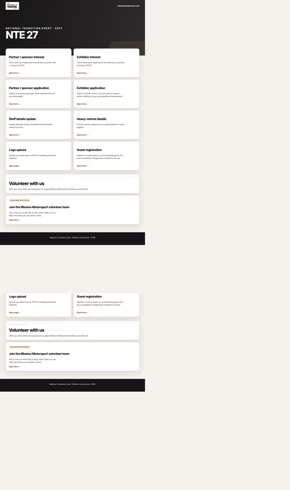
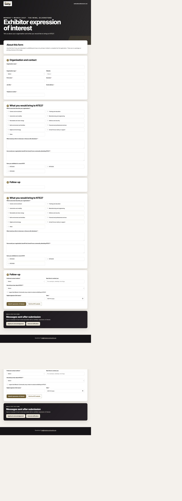
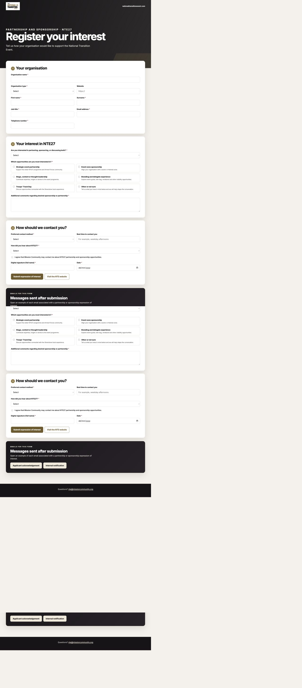
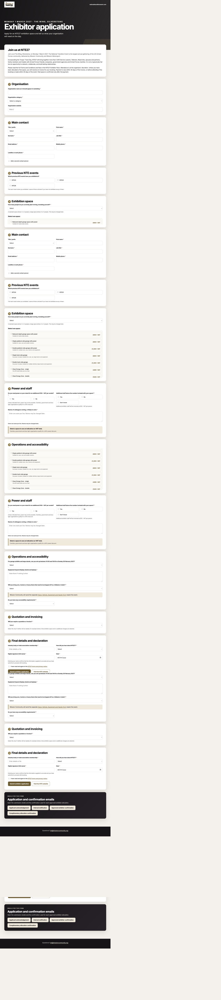
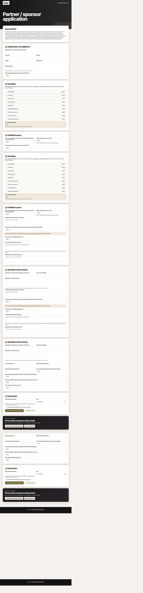
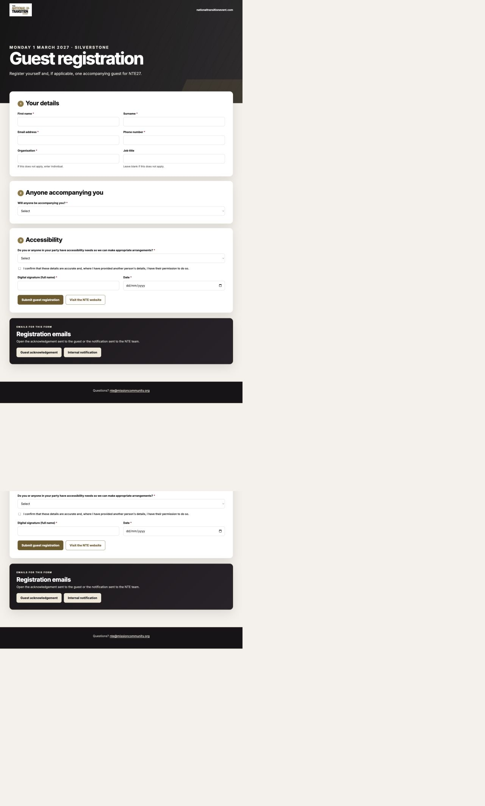
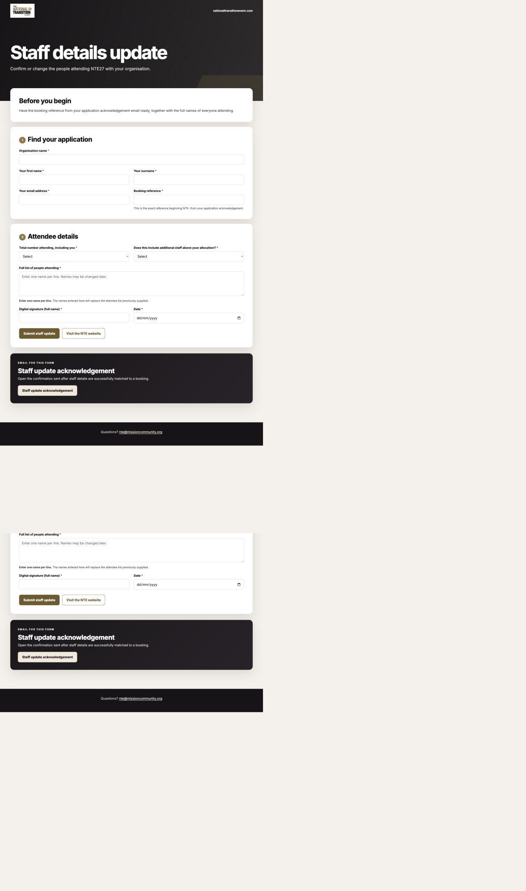
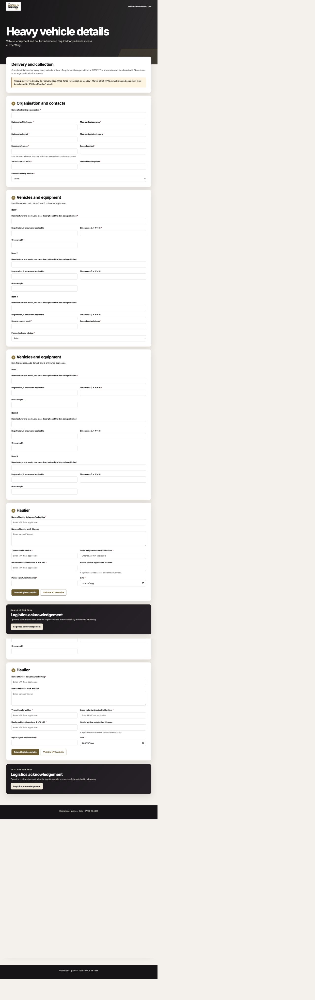
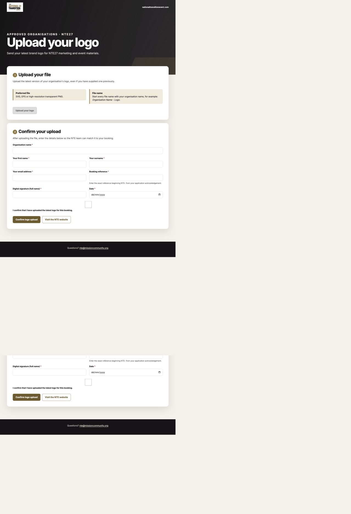
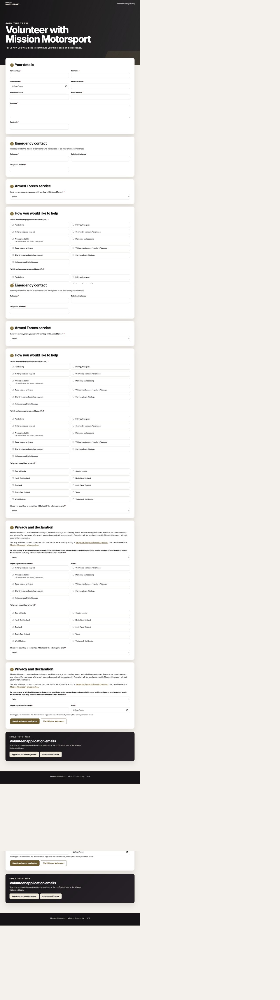

# NTE solution potential-problem report

**Audit date:** 25 August 2026  
**Scope:** Public forms, GitHub Pages delivery, Web-to-Lead mappings, Lead routing, pricing, conversion, supplementary updates, email automation, Account/Contact/Opportunity relationships, reports, the NTE Management app, Master Panel and Event Portfolio home page.  
**Change status:** Audit only. No form, Salesforce metadata, automation, record or deployment was changed during this review.

## Executive verdict

The solution is visually strong and already provides a coherent end-to-end operating workspace. Its central data model is suitable if Mission Community's intended unit of work is **one organisation booking for one NTE event, with the latest operational details stored on one Opportunity**.

It is not yet safe to describe the current repository as production-ready. This audit identified **49 potential problems: 4 critical, 18 high, 22 medium and 5 low**. Some are confirmed defects, some are release risks, and some are policy or architecture decisions that must be made before the system is relied upon.

The four critical release gates are:

1. The logo-update journey can mark a Salesforce booking as having supplied a logo without proving that any file was uploaded.
2. The hosted configurations still point at the MMUAT sandbox, include sandbox Web-to-Lead IDs and have no production logo-upload destination.
3. Thirty-eight Lead fields used by the solution are dependencies from the sandbox and are not yet contained in this repository.
4. The event code rolls forward automatically each April, while visible NTE27 wording, prices, dates and email templates remain hard-coded; this can silently create an NTE2028 record using NTE27 terms and prices.

The staff issue already identified is real and important, but it is not the only cross-cutting concern. The strongest additional themes are:

- a booking reference currently acts as the only credential for public staff, vehicle and logo updates;
- public Web-to-Lead posts can bypass browser-only validation;
- “review required,” cancelled, price-on-request and post-invoice amendments need stricter lifecycle rules;
- staff, guests, vehicles and commercial items are stored as fields/text on one record, limiting reconciliation and history;
- email acceptance is audited, but delivery and retry are not guaranteed;
- the dashboards are useful at present volumes, but several list and query limits will become visible as the data grows.

## Evidence and confidence

This report combines:

- a fresh browser review of all ten public pages on 25 August 2026;
- static tracing from every public input through field mappings, Apex, Flows, email templates, reports and Lightning components;
- the existing field-dependency inventory and staff-specific audit;
- automated form tests, which passed in this review;
- existing Salesforce metadata and the prior record-placement audit in this workspace.

The current shell session did not have a callable Salesforce CLI, so this was not a fresh record-by-record data reconciliation against every live MMUAT record. The signed-in Master Panel was available for visual review. Findings labelled **confirmed defect** are demonstrated by the current code/configuration; findings labelled **design risk**, **policy decision** or **scale risk** describe credible future failure modes.

## What is working well

- All public forms have a consistent, professional visual system and clear sectioning.
- Conditional fields are disabled when hidden, reducing stale hidden-answer submissions.
- Salesforce recalculates application prices server-side, so editing hidden browser prices does not determine the authoritative application total.
- Restricted or complimentary eligibility mismatches are marked `Review required` rather than silently accepted as valid pricing.
- Booking references are generated uniquely and matching rejects ambiguous duplicate references.
- The NTE Opportunity record type isolates event bookings from ordinary CRM Opportunities.
- Master Panel reads and milestone actions use sharing-aware/user-mode access rather than unrestricted UI operations.
- Quote, invoice and payment actions enforce the intended forward sequence.
- The present completion calculation checks the applicable finance, staff and logistics steps under its current rules.
- Successful staff and heavy-vehicle update Leads are deleted only after processing and acknowledgement, while failed submissions are retained for investigation.
- Client-facing forms are generated from the canonical source, reducing accidental manual divergence between repositories.
- Static regression tests cover current pricing/form mappings and passed during this audit.

## Journey review

### 1. Forms hub — good presentation, release-channel risk

The hub is clear, but it mixes NTE event journeys and the unrelated volunteer journey on one public surface. The pages also include client email-preview panels below live submission forms. Those previews are useful during review but expose internal-notification examples to applicants if the same URLs become the production channel.

### 2. Expressions of interest — usable, weak lifecycle linkage

The forms collect useful qualification information, but an expression of interest has no durable lineage key connecting it to a later application. Converting an EOI also does not create the same NTE booking history as converting an application. Mission Community therefore cannot reliably report an individual's complete EOI-to-application journey.

### 3. Exhibitor application — polished, commercially inconsistent around staff and amendments

The form covers the required operational and finance detail. Staff total, included allocation and additional charge are not one authoritative calculation, however. Price-on-request, eligibility review, later staff changes and already-issued invoices also need a defined adjustment model.

### 4. Partner/sponsor application — polished, package and access rules need decisions

The journey confirms partner/sponsor applications immediately and permits multiple packages. There is no machine-enforced invitation, package-compatibility, exclusivity or capacity rule. Staff allowance and charge cannot be derived from the initial application.

### 5. Guest registration — simple, but one Lead is not one attendee

A primary guest and one companion are stored together. This is adequate for a printable guest list, but not for individual consent, accessibility, cancellation, badge/check-in or attendance reporting for the companion.

### 6. Staff update — better validation, wrong source of truth

The latest form validates roster lines for numeric totals, but still asks the applicant to declare additional staff rather than deriving it from a snapshotted package allowance. `More than 9` prevents exact calculation, and a later update can reprice/reset finance using the current catalogue.

### 7. Heavy-vehicle update — useful snapshot, incomplete logistics model

The form captures the present brief, but is limited to three fixed items, stores dimensions and weights as free text, and can mark logistics complete while registration details remain absent. There is no “we are no longer bringing a heavy vehicle” correction path.

### 8. Logo update — confirmed critical defect

The upload destination is blank, but the confirmation form remains usable. The checkbox is not mapped to Salesforce, and the server deliberately bypasses logo validation before setting `NTE_Logo_Update_Provided__c = true`. This is a false-positive completion path, not merely a future enhancement.

### 9. Volunteer application — isolated from NTE, but privacy/lifecycle policy is unfinished

The Lead source and form type correctly keep volunteers out of NTE dashboards. The form collects high-sensitivity information, while one Yes/No response is copied to three different consent fields. A “No” response still submits and stores the data, and the stated two-year retention/renewal process has no matching automation in this repository.

> Screenshot note: the full-page browser capture process can repeat a narrow strip at a stitching boundary. That is a capture artefact and is not reported as a page defect.

## Ranked risk register

| ID | Severity | Type | Potential problem | Likely effect | Recommended treatment |
|---|---|---|---|---|---|
| R01 | Critical | Confirmed defect | Logo confirmation sets the booking checkbox without file evidence; the upload URL is blank and server validation is bypassed for `Logo Update`. | A booking disappears from Logo Updates even though no logo exists. | Block confirmation unless a real upload receipt/token is supplied and validated server-side. Reconcile existing “provided” records. |
| R02 | Critical | Release blocker | Canonical and generated hosted configurations are still MMUAT/sandbox configurations. | A supposedly live form can submit to the sandbox or fail after production field recreation. | Create a production configuration, production return URL and release-time environment check; fail closed if any sandbox identifier remains. |
| R03 | Critical | Release blocker | Thirty-eight required Lead field definitions are external sandbox dependencies and absent from the package. | Production validation/deployment fails or submissions lose intended values. | Bring compatible metadata into the production package and regenerate production Web-to-Lead IDs in the documented sequence. |
| R04 | Critical | Confirmed design defect | Event code rolls forward automatically each April, but pages, event date, catalogue version, prices and emails remain NTE27-specific. | NTE2028 submissions can receive NTE27 prices, dates, terms and messages. | Replace silent annual rollover with one versioned event configuration and a release gate that validates every dependent surface. |
| R05 | High | Integrity risk | Main forms rely on HTML/JavaScript conditional validation; a direct Web-to-Lead POST can bypass it. | Incomplete or contradictory records enter Salesforce even though the browser UI would reject them. | Add authoritative Salesforce validation/normalisation for each form type or place a controlled server endpoint in front of Web-to-Lead. |
| R06 | High | Abuse risk | Public forms have only a honeypot; there is no CAPTCHA, rate limit, replay protection or server-side spam scoring. | Spam Leads, email bursts, automation load and noisy operational queues. | Add proportionate anti-abuse controls and monitoring before wide public release. |
| R07 | High | Security/design risk | Exact booking reference is the only effective credential for staff, vehicle and logo updates; supplied email/organisation are not matched. Updates run in system mode. | Anyone who obtains a reference can overwrite personal/logistics data or close a logo task. | Use a signed, expiring update link or verify a second booking attribute and enforce field-level update scope. |
| R08 | High | Confirmed design defect | Staff total, included allocation, additional count and roster are independent answers. | Incorrect invoices and inconsistent attendance totals can look complete. | Implement the authoritative numeric model in the separate staff audit before release. |
| R09 | High | Confirmed design defect | `More than 9` and text-based staff fields prevent dependable mathematics and reporting. | Headcount, extra-staff cost and roster reconciliation cannot be proven. | Introduce numeric 1–99 fields and migrate/backfill with explicit exceptions. |
| R10 | High | Confirmed defect risk | A staff update reprices with the current catalogue, overwrites the total, and can reset invoice/payment milestones; price-on-request agreements have no separately retained base. | An agreed or paid booking can change value or reopen finance unexpectedly. | Store original catalogue/allocation snapshots and explicit adjustment/delta records; require controlled finance approval after invoicing. |
| R11 | High | Lifecycle defect | `Pricing Status = Review required` is not itself a completion blocker. | An ineligible or exceptional complimentary booking can become “Completed” once other tasks are done. | Add pricing-review approval to conversion/completion rules and reporting. |
| R12 | High | Commercial risk | No capacity, exclusivity or incompatible-package rules exist for garages, zones, sockets or sponsor packages. | The same scarce benefit/space can be oversold, and mutually inconsistent packages can be accepted. | Agree capacities/compatibility and add reservation controls or an explicit manual-approval gate. |
| R13 | High | Traceability risk | EOI records have no lineage/reference to the later application; converted EOIs do not follow the application-to-NTE Opportunity path. | Conversion and campaign-effectiveness reporting loses the start of the journey. | Add an immutable enquiry/application correlation key or an explicit “create application from EOI” process. |
| R14 | High | Operational gap | There is no public withdrawal, cancellation, amendment or booking-reference recovery journey. | Applicants email the team, duplicate applications, or cannot update when their acknowledgement is lost. | Define supported amendment/cancellation paths and a secure reference recovery process. |
| R15 | High | Reliability risk | All four active Flows contain no explicit fault connectors. | A lookup, DML or action fault can still generate unhandled Flow errors/admin email floods. | Route every material Flow fault to a controlled handler/log and add tests for expected failure paths. |
| R16 | High | Data-quality risk | Standard Lead conversion can link to the wrong existing Account/Contact or create duplicates; no packaged matching policy governs NTE conversion. | Related lists, ownership and organisation history become incorrect. | Configure and test NTE-aware matching/duplicate rules plus clear conversion guidance. |
| R17 | High | Confirmed logic risk | A booking with `NTE Attendance Status = Cancelled` is not automatically excluded unless its Opportunity Stage is also Closed Lost. | Cancelled bookings can remain in totals, finance, readiness or Completed. | Make cancellation authoritative and synchronise/exclude it in all dashboard/report definitions. |
| R18 | High | Privacy risk | One volunteer Yes/No answer is copied to PII, contact and promotion consent; a No still submits all sensitive answers. | Consent is ambiguous and processing may conflict with the language shown to the applicant. | Separate lawful-purpose acknowledgements and optional marketing consent; obtain DPO/legal approval. |
| R19 | High | Compliance/process gap | The volunteer form states two-year retention and renewed consent, but no retention/deletion/renewal automation is packaged; no age/guardian policy is evident. | Data can be retained beyond the stated promise or be collected from an unsupported age group. | Agree policy, implement retention controls and document ownership before launch. |
| R20 | High | Operational gap | Volunteer Leads are not routed to a dedicated volunteer owner/queue; notification goes to the Web-to-Lead-assigned owner. | Applications can be missed or handled inconsistently. | Assign a stable volunteer queue/owner and monitor unworked applications. |
| R21 | High | Reliability risk | Email audit records Salesforce acceptance, not delivery. There is no general retry/reconciliation; approval confirmation depends on a 15-minute, 100-record sweep and enqueue failures are not durable. | Applicants or the team can miss a critical email while the record appears processed. | Add scheduled retry/reconciliation, durable failure alerts and delivery monitoring where available. |
| R22 | High | Release/privacy risk | Client preview panels, including internal-notification examples, sit below the public forms. | Applicants can see review-only material and internal data examples; production pages look like demos. | Separate review/demo URLs from clean applicant URLs or hide previews in production builds. |
| R23 | Medium | UX risk | Long applications have no save-and-resume capability. | Mobile users or applicants gathering finance/logistics details lose work and submit lower-quality placeholders. | Offer a secure resume link or shorten the initial application and collect later operational details separately. |
| R24 | Medium | Release risk | The client repository redirects successful submissions to a thank-you page in the team repository/domain. | Version availability and applicant trust depend on two independently published sites. | Host the acknowledgement on the same controlled production domain/build. |
| R25 | Medium | Legal/audit risk | Typed signatures and dates are stored, but the exact terms/privacy document version is not snapshotted and date bounds are weak. | The team cannot prove precisely which wording was accepted. | Store terms version/hash/URL and server timestamp; validate declaration date sensibly. |
| R26 | Medium | Privacy/UX risk | EOI and guest journeys do not present an equally explicit privacy-notice link at the point of submission. | Applicants may not receive consistent processing information. | Add approved, concise privacy wording/link to every collection journey. |
| R27 | Medium | Policy decision | Partner/sponsor application is publicly reachable and automatically worded as confirmed, without an invitation token. | An uninvited organisation can submit a form intended for pre-approved applicants. | Confirm the policy; if invite-only, use signed links or require internal approval before confirmation. |
| R28 | Medium | Maintenance risk | Pricing exists in both browser JavaScript and Apex and is hard-coded to one catalogue version. | The two implementations or annual values can drift despite current regression tests. | Generate both from one versioned catalogue and require a parity test in every release. |
| R29 | Medium | Model limitation | Packages, spaces and charges are multiselect/text plus aggregate currency fields, not immutable commercial line items. | Discounts, amendments, credits, VAT treatment and item-level finance reporting are difficult to audit. | Retain the simple model if requirements stay simple; otherwise introduce booking line/adjustment records. |
| R30 | Medium | Metric defect | For a mixed known-price plus price-on-request submission, Home “known value” returns zero until the whole price is confirmed. | Useful known package value disappears from financial metrics and can disagree with record detail. | Display known component subtotal separately from unconfirmed remainder, with explicit metric definitions. |
| R31 | Medium | Model limitation | Heavy vehicles are three fixed field groups; dimensions/weights are free text and units are not normalised. | Vehicle counts and operational sorting become unreliable; a fourth item cannot be represented. | Use repeatable child items if logistics needs item-level planning; at minimum normalise units and validation. |
| R32 | Medium | Logic risk | Registration can be omitted while the heavy-vehicle update timestamp marks logistics complete. | A booking can disappear from the outstanding queue before access-critical details are supplied. | Define which fields are mandatory for completion and allow a separate “details pending” state. |
| R33 | Medium | Operational risk | Heavy update has no “no longer bringing a vehicle” path and can replace primary/secondary event contacts with the logistics submitter. | Stale vehicle requirements remain, or future communications go to the wrong person. | Add explicit withdrawal and keep logistics contact separate unless the user deliberately changes the main contact. |
| R34 | Medium | Model limitation | Guest plus companion are one Lead, with no independent companion consent, accessibility, cancellation or check-in state. | Person-level attendee operations and accurate headcount changes are manual. | Keep only if a printable registration list is sufficient; otherwise use one attendee record per person. |
| R35 | Medium | Privacy risk | Accessibility, billing and contact details are reproduced in internal email templates. | Sensitive data is copied into mailboxes with wider retention/access than Salesforce. | Minimise email content and link authorised staff to the Salesforce record for sensitive detail. |
| R36 | Medium | Reliability risk | Inbound NTE email handling intentionally fails a transaction above 100 messages and depends on one configured routing username. | A bulk/replay incident or inactive user can interrupt routing and notifications. | Monitor the integration user, document substitution and test bulk/failure handling. |
| R37 | Medium | Metric semantics | Time filtering uses Lead creation for pre-conversion records and Opportunity creation for converted bookings. | “Last week/month” does not describe one consistent business event across a journey. | Choose submission date, conversion date or last activity as an explicit metric and store it consistently. |
| R38 | Medium | Filter semantics | Owner filters use each record's current Lead/Opportunity owner and offer every active standard user and queue. | Counts change across conversion/reassignment and selectors become cluttered with non-NTE owners. | Define NTE ownership semantics and restrict the selector to relevant users/queues. |
| R39 | Medium | Scale risk | Master Panel counts can be correct above 2,000 records, but record retrieval is capped and offset is clamped at 1,950. | Older matching records become unreachable in the panel while totals imply they exist. | Implement keyset/server pagination and make result limits visible before volumes approach the cap. |
| R40 | Medium | Scale risk | Related Opportunities are limited to 200 and the Home dashboard queries all matching records to aggregate values. | Long-lived relationships truncate history; high event volume can approach governor limits. | Add pagination/aggregation queries and test realistic growth thresholds. |
| R41 | Medium | Context risk | Global report/list links cannot inherit active event, time and owner filters from the LWC. | A user clicks from a filtered panel into a broader cross-event report and believes it is the same population. | Label the context shift prominently or build parameter-aware drill-down pages. |
| R42 | Medium | Metric semantics | “Most recent” adds main Leads and approved Opportunities, so converted journeys can be counted twice; pipeline rows overlap and Finance includes paid activity. | Users can treat non-exclusive operational slices as a true funnel and reconcile totals incorrectly. | Publish a metric dictionary and use mutually exclusive stages where a funnel is intended. |
| R43 | Medium | Access risk | `NTE Management User` grants field/class/tab access but no object permissions; a sharing rule grants all internal users Edit to NTE Opportunities. | Some intended users may lack base access, while others may receive broader edit access than required. | Define least-privilege personas, include/verify object access and narrow sharing where appropriate. |
| R44 | Medium | Reporting limitation | Staff, vehicle and guest reports are one booking/registration row with text or fixed item columns; report and LWC definitions are independently maintained. | Per-person/per-vehicle operations are difficult, and dashboard/report totals can drift. | Decide the required reporting grain and add shared reconciliation tests/definitions. |
| R45 | Low | UX limitation | A future event with no Lead or Opportunity does not appear in the dynamic event selector. | Staff cannot pre-select a new edition until its first record exists. | Add a small event configuration record if pre-event setup becomes necessary. |
| R46 | Low | Policy decision | Logo receipt is not part of the Completed definition even after the false-positive defect is fixed. | A booking can be operationally complete while branding is still outstanding. | Confirm whether this is intentional; if not, add logo applicability/completion to the rule. |
| R47 | Low | UX semantics | Master Panel presents operational “Approved/Completed,” while standard related lists can show the Opportunity's ordinary sales Stage. | Users may see two different stage vocabularies for one record. | Train users or expose a clearly named NTE operational status consistently. |
| R48 | Low | Code hygiene | Duplicate harmless statements/selected fields remain in form JavaScript and Master Panel query construction. | No current user failure, but future edits are easier to get wrong. | Remove during the next controlled refactor and keep lint/static checks in the release gate. |
| R49 | Low | Information architecture | Volunteer and NTE forms share the same forms hub despite different teams, purposes and data policy. | Navigation and ownership are less clear than they could be. | Split or clearly group the two services when moving to an organisation-owned production domain. |

## Data model assessment

### The current model is appropriate for

- one organisation booking per event;
- showing the latest package, total, staff roster and logistics snapshot;
- lightweight quote/invoice/payment tracking;
- operational queues for missing updates;
- event-level totals at modest volume;
- Account and Contact visibility of NTE Opportunities.

### The current model is not naturally suited to

- one record per attendee, badge or check-in;
- one record per heavy vehicle/item and access movement;
- capacity/exclusivity management for spaces, sockets or sponsorship benefits;
- immutable commercial line items, discounts, credits and post-invoice adjustments;
- complete EOI-to-application-to-booking lineage;
- historical audit of every public update;
- secure self-service editing of an existing booking.

That does not mean all child objects must be built now. The safe decision is to write down which operational capabilities the client actually expects. If their requirement remains “printable lists and latest details,” correcting validation and lifecycle rules is enough. If they expect person-level check-in, vehicle scheduling, stock/capacity control or formal finance adjustments, the one-Opportunity snapshot model will create recurring workarounds.

## Release gates

### Must be fixed before production

1. Prevent false logo completion and choose a real organisation-owned upload destination.
2. Package/recreate all 38 Lead dependencies and replace every sandbox Web-to-Lead ID.
3. Introduce a production configuration that cannot silently retain sandbox endpoints, return URLs or notices.
4. Make event edition, date, wording, terms and catalogue version one controlled release unit.
5. Add server-side integrity controls for public submissions and supplementary updates.
6. Resolve the authoritative staff/allocation/adjustment model.
7. Block or approve `Review required` pricing before conversion/completion.
8. Add Flow fault routing and durable email retry/monitoring.
9. Correct cancelled-booking exclusion and reconcile existing cancelled records.
10. Obtain approved volunteer privacy, consent, retention and ownership rules.

### Client/team decisions required

1. Are partner/sponsor applications invitation-only, and are they automatically confirmed?
2. Which package/space combinations are allowed, exclusive or capacity-limited?
3. How do staff allowances combine when multiple packages are chosen?
4. How are increases, reductions, credits and refunds handled after quote/invoice/payment?
5. Is a booking reference alone acceptable authority for public updates?
6. Must a vehicle registration be present before logistics is complete?
7. Is logo receipt required for a booking to be fully complete?
8. Is one text roster/list sufficient, or are person/vehicle-level operations expected?
9. What does “Cancelled” do to finance, reports and dashboard totals?
10. Who owns volunteer applications, retention and data-subject requests?

### Monitor after release

- form-to-Lead acceptance rate and spam volume;
- automation/email failures and acknowledgements not delivered;
- duplicate Lead/Account/Contact rates at conversion;
- records in `Review required`, unmatched update and missing-price states;
- dashboard/report reconciliation by event code;
- page/query volumes approaching 2,000/200 limits;
- yearly configuration completeness before the April event-code boundary.

## Recommended next audit sequence

1. Resolve the client decisions above and update the data dictionary/metric definitions.
2. Fix the four critical release gates in an isolated branch.
3. Add adversarial submission tests that post directly to Web-to-Lead, not only through the browser.
4. Add failure-path tests for every Flow and email service.
5. Reconcile every retained MMUAT Lead and Opportunity against the corrected definitions.
6. Perform a production validation deployment with no data mutation.
7. Publish clean applicant-only pages on an organisation-owned domain.
8. Run a controlled production smoke test with traceable records and an agreed cleanup plan.

## Related internal evidence

- [Staff collection and update audit](STAFF_COLLECTION_AND_UPDATE_AUDIT_2026-08-25.md)
- [NTE record placement audit](NTE_RECORD_PLACEMENT_AUDIT_2026-08-23.md)
- [Pre-production field dependencies](../pre-production-dependancies.md)
- Fresh public-page screenshots: [`solution-risk-2026-08-25`](solution-risk-2026-08-25/)

## Source areas reviewed

- Public pages and `assets/forms.js`, `assets/config.js`.
- `NTEPricingService`, `NTEUpdateSubmissionService`, inbound/approval email services and conversion automation.
- `NTE_MasterPanelController`, NTE Home/Master Panel LWCs and related-opportunity components.
- Active NTE and volunteer Flows, email templates, permission sets, sharing rules, list views and reports.
- Client-repository generated mirror and release/build documentation.

