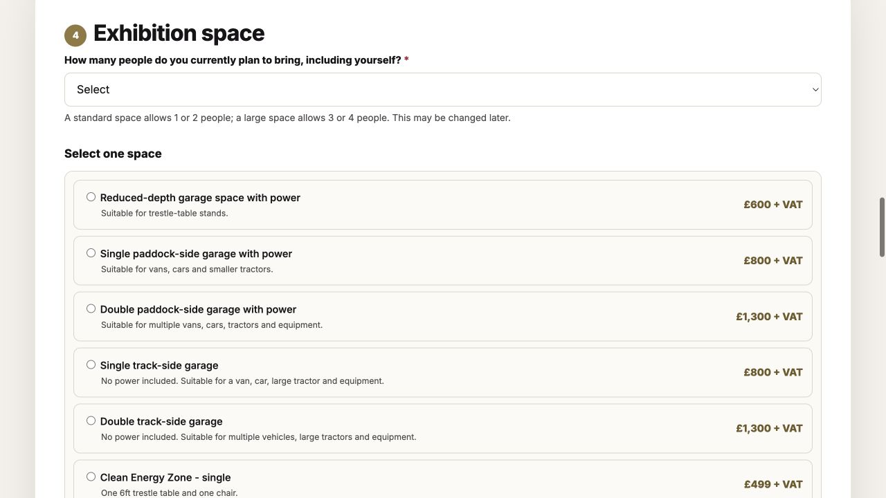
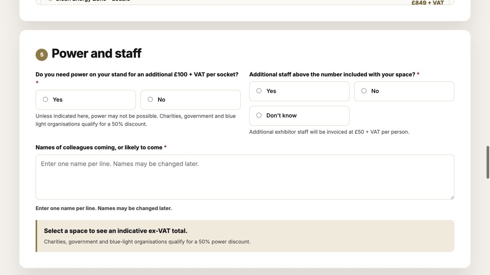
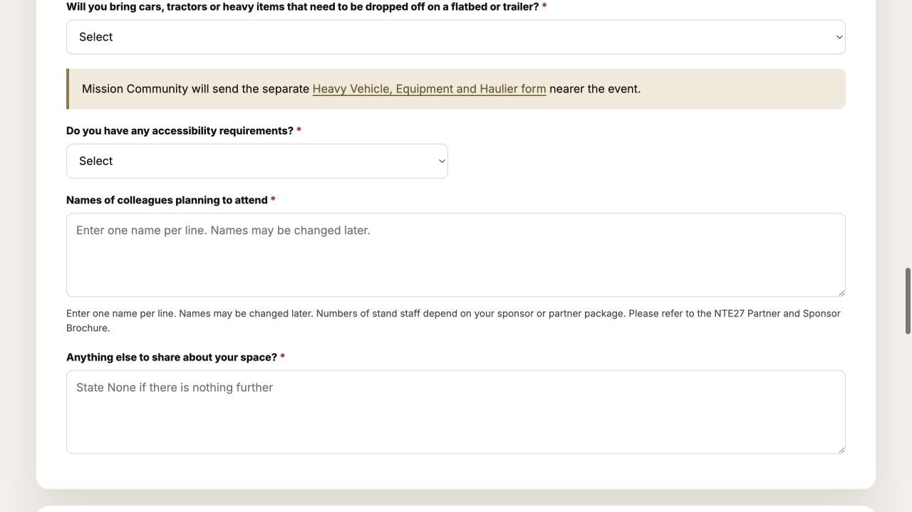
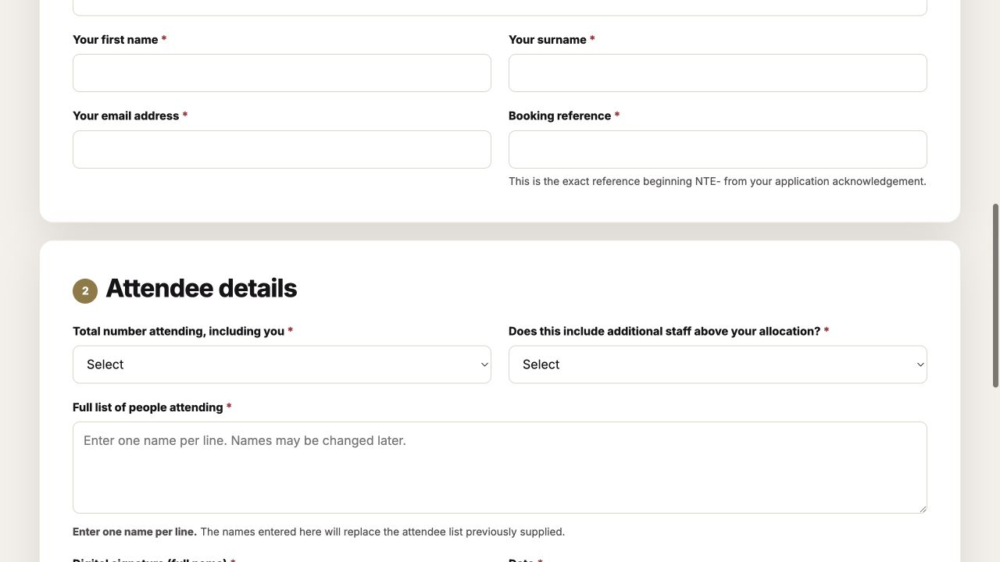

# NTE staff collection and update audit

**Date:** 25 August 2026  
**Scope:** Exhibitor Application, Partner / Sponsor Application, Staff Details Update, Salesforce conversion, pricing, finance effects and operational reporting.  
**Change status:** Audit only. No form, Salesforce metadata, automation, data or deployment was changed.

## Executive verdict

The current design does not have one authoritative staff calculation. It independently asks for a planned total, whether additional staff are required, an additional count and a list of names. Those answers can disagree, and neither the browser nor Salesforce knows the included staff allocation for the selected space or package.

The proposed direction is correct:

1. Collect one numeric **Total staff attending** value from 1 to 99.
2. Derive **Included staff allocation** from the selected space or partner/sponsor package.
3. Calculate **Additional staff count = max(Total staff attending - Included staff allocation, 0)**.
4. Calculate the charge from the derived additional count.
5. Ask for every attendee's full name in one roster, including the submitter only when that person is attending.

Before implementation, Mission Community must approve the allocation rule for every space and package, especially multiple partner/sponsor packages and price-on-request arrangements.

## Current journey

### 1. Exhibitor application — at risk



- Planned attendance is a picklist containing 1–9 and `More than 9`.
- The form describes standard and large-space allowances, but the selected space does not carry a machine-readable staff allocation.
- `More than 9` cannot be added, subtracted or reliably aggregated.

### 2. Exhibitor additional staff — high risk



- The applicant separately declares Yes, No or Don't know for additional staff.
- A Yes answer reveals another 1–8 picklist.
- Names, planned total and additional count are not reconciled on the application.
- Pricing trusts the declared additional count, so a numerically inconsistent application can look complete and produce an incorrect staff charge.

### 3. Partner / sponsor application — incomplete



- The initial form collects only a names textarea.
- It does not collect total staff, included allocation or additional staff.
- It refers the applicant to the brochure to understand their allowance, so Salesforce cannot calculate staff charges from the submitted application.
- Multiple packages can be selected, but no rule says whether their staff allocations should be added, take the maximum, or be agreed manually.

### 4. Staff details update — improved validation, incomplete calculation



- The current update requires the total, a Yes/No additional-staff answer and the full replacement roster.
- For totals 1–9, browser and server checks now require the number of non-blank name lines to match the total.
- For `More than 9`, only “at least ten names” is known; the exact total is lost.
- The applicant still declares whether staff are above an allocation that the form does not display or calculate.
- The update overwrites the previous roster and pricing values rather than retaining an immutable change history.

## Findings

### Critical — no authoritative included allocation

There is no field or pricing rule that resolves the number of staff included with a selected exhibitor space or partner/sponsor package. Therefore the system cannot prove that planned staff equals included staff plus additional staff.

### Critical — price-on-request bookings can lose their agreed total after a staff update

When an agreed price is confirmed, Salesforce stores the whole agreed amount in `Amount` and `NTE_Listed_Price_Total__c`. A later staff update recalculates the total from standard package, space, socket and staff components and overwrites both fields. Because the manually agreed base is not stored as a separate component, the confirmed price can be lost.

This needs to be designed together with the staff change: preserve an agreed base amount and apply only the staff-price delta, or retain a separately approved whole-booking total with an explicit repricing workflow.

### High — initial exhibitor validation allows contradictory answers

The browser calculates staff price from the applicant-selected additional count. It does not validate:

- total staff against number of names;
- additional staff against total staff;
- additional staff against the selected space allowance;
- Don't know against invoice completeness.

The Salesforce pricing service repeats the same trust model and therefore cannot repair contradictory submissions.

### High — partner/sponsor staff cannot be priced from the initial application

The partner/sponsor application has no total or additional-staff inputs. The names field is not a safe substitute for a count, particularly while names are provisional.

### High — paid and invoiced bookings need a defined change policy

The current update logic clears invoice-provided and payment-received markers when a staff change alters the total. That avoids leaving an incorrect paid total, but it loses the distinction between:

- a supplementary invoice for extra people;
- a credit or refund after reducing people;
- a reissued whole invoice;
- a manually agreed exception.

Finance should approve the intended policy before implementation. A staff-price delta and change history are safer than silently resetting the entire booking's finance state.

### High — count fields are stored as text

The Opportunity fields for planned and additional staff are Text(40). This prevents dependable numerical summaries and admits values such as `More than 9`. The reports can display these fields but cannot reliably total the expected headcount.

For production migration, create new numeric fields and backfill them. Do not change the type of populated text fields in place.

### Medium — “including you” makes an unsafe assumption

The form submitter may not attend. Use:

- **Total number of event staff attending from your organisation**
- **Enter the full name of every person attending from your organisation, including your own name if you will attend. Enter one name per line.**

### Medium — initial names may genuinely be provisional

Forcing a complete final roster during an early application can encourage fake names or repeated `TBC` entries. Recommended policy:

- application: collect numeric total, all currently known names and a `Roster complete` status;
- final staff update: require exactly one real name per attendee before marking staff details complete.

This preserves an accurate invoice count without pretending that every name is final months ahead of the event.

### Medium — booking reference is the effective update credential

The update service matches on exact booking reference. The form also collects an email address, but the matching process does not verify that it belongs to the booking. Consider a signed one-time update link or a secondary match against the booking email before accepting personal-data changes.

### Medium — only the latest roster is retained on the Opportunity

Successful update Leads are intentionally deleted after processing and the Opportunity roster is overwritten. The current staff fields do not have feed history tracking enabled. This makes it difficult to answer who changed a roster, what changed and what finance adjustment followed.

Use field history for key totals/statuses or retain a small internal staff-update audit record. This does not require exposing previous rosters on the public form.

### Medium — a single textarea limits per-person operations

A long-text roster is suitable if Mission Community only needs a printable list. It is less suitable for badges, individual amendments, duplicate detection or per-person check-in. A child `NTE Attendee` object would be cleaner if those operations become a requirement, but it is not necessary merely to correct billing.

### Medium — the static update form cannot safely prefill booking details

The current public form cannot show the stored package, allocation, current total and current roster without a secure Salesforce-backed link or authenticated experience. Retyping the whole roster creates avoidable omission risk. A signed update link would allow a much better edit experience, but it is a larger design choice than the minimum calculation fix.

## Review of the proposed solution

### What is right

- Replacing `More than 9` with a number input from 1 to 99 is the correct approach.
- Removing applicant-entered additional-staff Yes/No and count is correct; both are derived facts.
- Deriving extra staff from total minus allocation removes a major invoice ambiguity.
- One complete roster is simpler for Mission Community than trying to infer whether the submitter is attending.
- The same model should be used on both initial applications and the later update.

### Refinements needed

1. Do not always say “including you”; say “including your own name if you will attend.”
2. Store the included allocation on the booking as a snapshot. If package rules change next year, an existing booking must retain the allowance under which it was agreed.
3. Do not rely only on browser JavaScript. Salesforce must perform the authoritative calculation again after submission.
4. Define how multiple sponsor packages affect allocation.
5. Define manual allocation and pricing for price-on-request/extra-large arrangements.
6. Separate the agreed base price from subsequent staff-price adjustments.
7. Decide whether the initial roster may be incomplete; do not mix an exact billed count with an implicitly incomplete names list without a status.

## Recommended target model

| Item | Type | Source |
|---|---|---|
| Total Staff Attending | Number(2,0), 1–99 | Applicant |
| Included Staff Allocation | Number(2,0) | Catalogue rule, snapshotted on booking |
| Additional Staff Count | Number(2,0) | `max(Total - Included, 0)` |
| Additional Staff Required | Formula/derived Boolean | `Additional Count > 0` |
| Additional Staff Unit Price | Currency | Versioned catalogue rule |
| Additional Staff Total | Currency | `Additional Count × Unit Price` |
| Staff Roster | Long Text Area initially | Applicant/update |
| Staff Roster Status | Picklist: Draft, Complete, Needs update | Derived/user confirmed |
| Staff Pricing Adjustment | Currency | Difference between previous and new staff total |
| Agreed Base Price | Currency | Manual price confirmation for POA bookings |

### Authoritative calculation

```text
totalStaff = applicant numeric input (1..99)
includedStaff = snapshotted allocation for the selected booking/package
additionalStaff = max(totalStaff - includedStaff, 0)
additionalStaffTotal = additionalStaff * applicable unit price
```

The form may show this calculation immediately, but Salesforce must recalculate it from allowlisted rules and reject or flag any mismatch.

## Data evidence from MMUAT

The sandbox is dominated by retained QA and deliberate edge-case records, so these counts demonstrate what the implementation permits rather than a client error rate.

- 83 NTE Opportunities were reviewed; 81 were application bookings.
- Of 49 exhibitor Opportunities, 22 had no planned count, 10 had no roster and four had a numeric planned-count/roster mismatch.
- Of 32 partner/sponsor Opportunities, 27 had no planned count, reflecting the initial form's missing total field.
- 141 application Leads were reviewed. All 65 partner/sponsor Leads lacked a planned total because that form does not collect one.
- 25 staff-update Leads were reviewed including deleted successful temporary Leads: 22 processed successfully and were deleted by the authorised automation; three were retained for failure/no-match handling.
- The current v6 update validation corrects exact roster counts for numeric values 1–9, but `More than 9` and allocation reconciliation remain unresolved.

## Decisions required before any build

1. Exact included staff allocation for every exhibitor space.
2. Exact included staff allocation for every partner/sponsor package.
3. Allocation rule when more than one package is selected: sum, maximum, primary package only or manual agreement.
4. Treatment of extra-large and price-on-request bookings.
5. Whether initial attendee names must be complete or may be marked provisional.
6. Finance handling for increases and reductions after quote, invoice or payment.
7. Whether a booking reference alone is sufficient to authorise a roster change.
8. Whether Mission needs only a printable roster or individual attendee records for badges/check-in.

## Recommended implementation order after approval

1. Approve and version the allocation matrix and finance-change policy.
2. Add new numeric/allocation/agreed-base fields without altering populated text fields.
3. Implement the same calculation in the form preview and Salesforce server-side pricing.
4. Update both application forms to collect total staff and roster consistently.
5. Update the staff form to show or securely resolve the stored allocation, recalculate extras and validate the final roster.
6. Backfill existing bookings with explicit exception reporting; do not guess unknown package allocations.
7. Update conversion mapping, reports, Master Panel and finance totals to use the numeric fields.
8. Test boundary values, multiple packages, POA bookings, staff increases/decreases and post-invoice/payment adjustments before release.

## Source evidence

- `exhibitor-application.html`: planned-count picklist and independent additional-staff inputs.
- `partner-sponsor-application.html`: names-only staff capture.
- `staff-update.html`: replacement roster and applicant-declared additional staff.
- `assets/forms.js`: browser pricing and current cross-field validation.
- `force-app/main/default/classes/NTEPricingService.cls`: Salesforce staff pricing.
- `force-app/main/default/classes/NTEUpdateSubmissionService.cls`: update matching, validation, overwrite and repricing behaviour.
- `force-app/main/default/classes/NTE_MasterPanelController.cls`: agreed-price confirmation.
- Opportunity staff field metadata and NTE operational reports.
